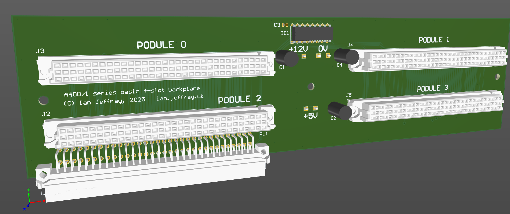

# Acorn A400/1 four-slot basic backplane

November 2025

This is my implementation of a four-slot backplane for Acorn A400/1 series machines.  I call this a "basic" backplane because it doesn't have the "Unix" PALs for interrupt decoding / masking.  These are not required/used by RISC OS anyway.  It also doesn't expose the data bus on the B row of pins - this was only ever used by the very old floating point podule anyway.

## Licence

No warranty is provided, and this work is used at your own risk.  

Licenced as CC BY-SA 4.0

Copyright 2025 Ian Jeffray

